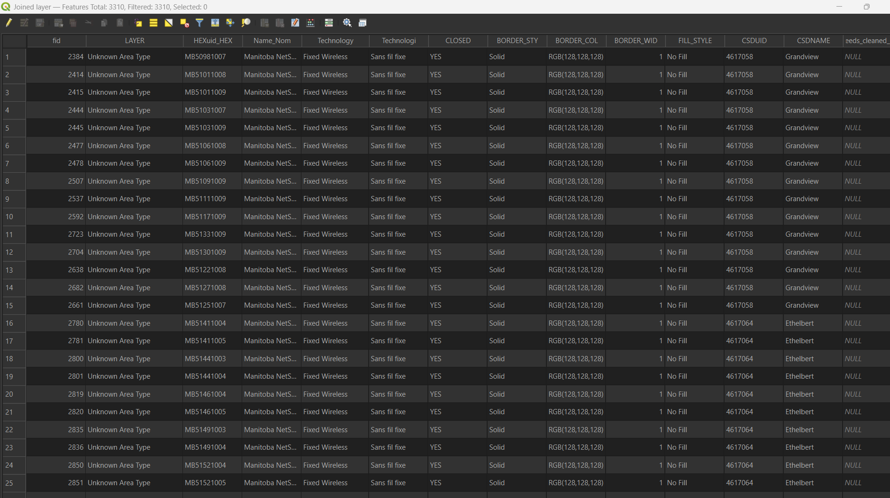
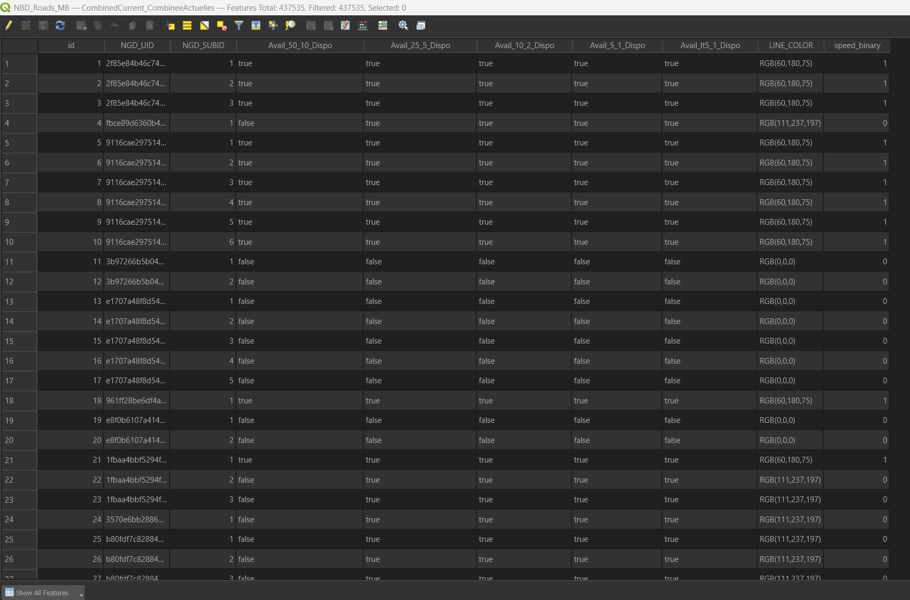
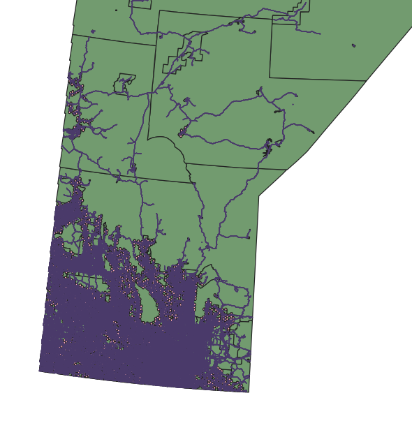
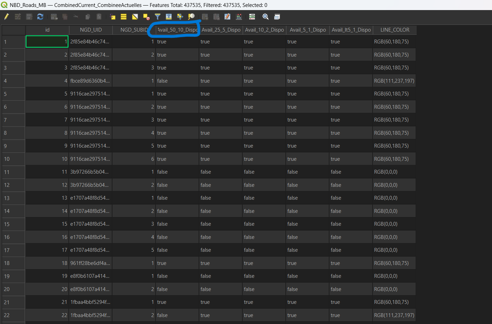
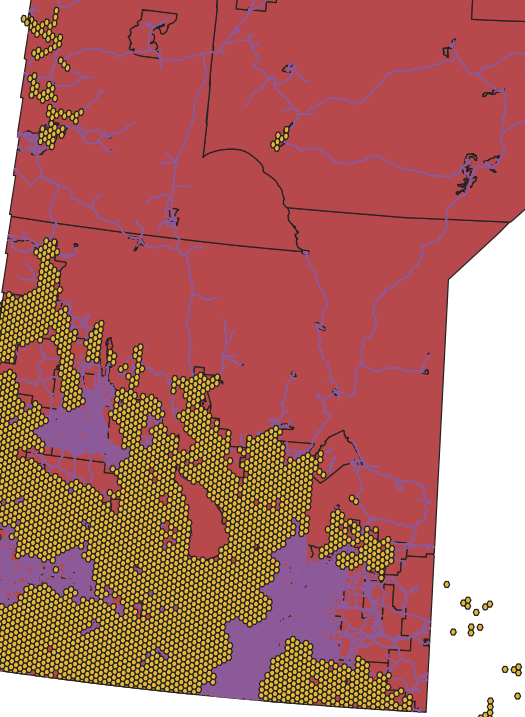
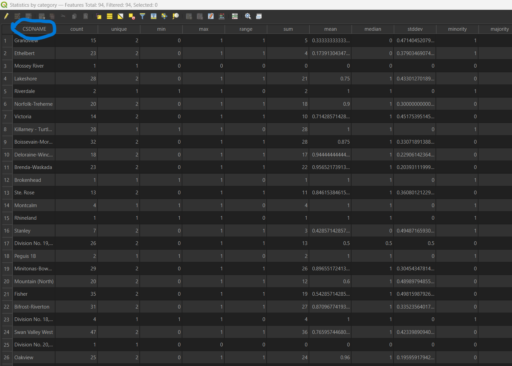
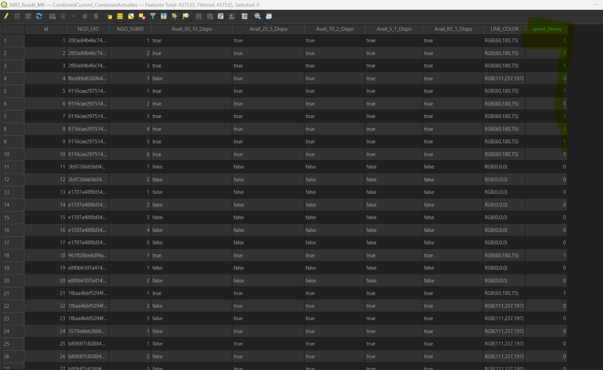
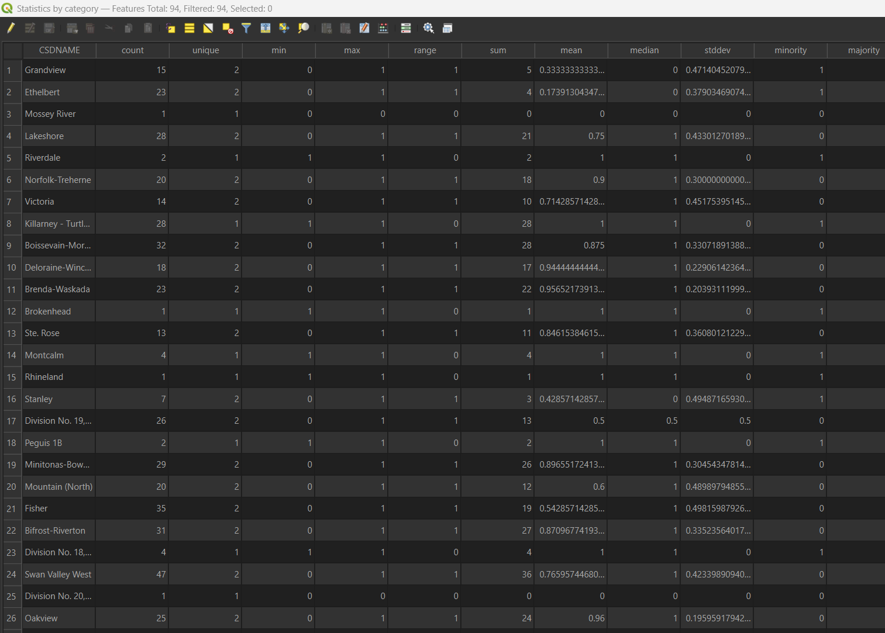
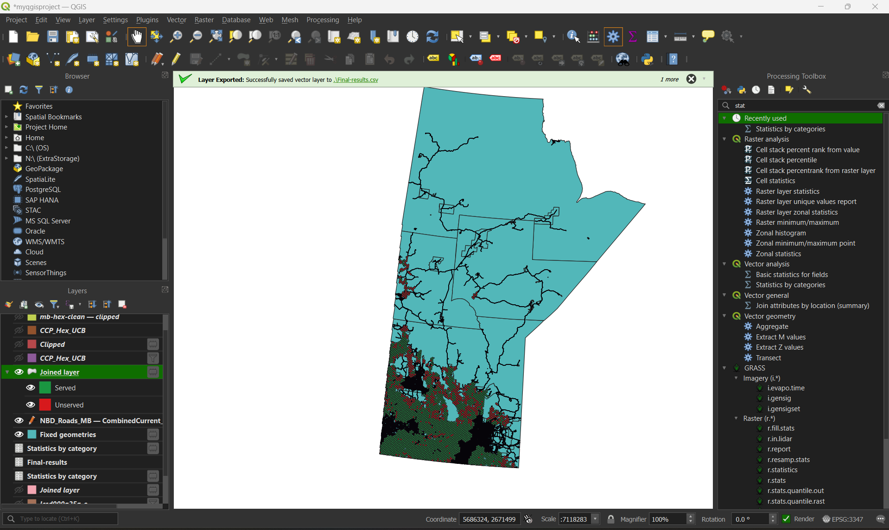

# Broadband Accessibility Analysis in Manitoba Using QGIS

## Overview
This project analyzes broadband availability across Manitoba by integrating telecommunications data with 2021 Census demographics. The goal is to identify underserved regions where population levels are high relative to broadband access.

The analysis is conducted using QGIS and demonstrates how geospatial techniques can be applied to infrastructure and connectivity challenges at a provincial level.

## Objective
To identify underserved regions in Manitoba by:
- Integrating broadband availability data with census population data  
- Creating a metric to quantify gaps in connectivity  
- Visualizing underserved areas using geospatial mapping  

## Data Sources
- Broadband availability data from Innovation, Science and Economic Development Canada  
- 2021 Census population data from Statistics Canada  
- Census boundary shapefiles (CSD or DA level) filtered for Manitoba  

## Tools and Technologies
- QGIS  
- CSV datasets  
- Shapefiles  

## Methodology

# Manitoba Broadband Competitive Gap Analysis

## Project Overview

This project analyzes 50/10 Mbps broadband coverage across Manitoba using a 1 km hexagon grid to identify underserved communities. The objective is to highlight coverage gaps and support infrastructure planning.

---

## Step 1: Initial Objective

The analysis began with:
- A 1 km hexagon grid covering Manitoba  
- Broadband availability data from the National Broadband Data (NBD) framework  

---

## Step 2: Failed Join (ID Mismatch)

An initial attempt was made to join broadband CSV data to the hexagon grid.

Issue:
- HexUIDs were in the 5M range  
- CSV PHH IDs were in the 7–9M range  
- The join failed, producing null values  

<p align="center">
  <br>
  <em>Join failure caused by mismatched ID ranges</em>
</p>

---

## Step 3: Data Discovery

The failure was traced to a version mismatch:
- The hex grid and broadband dataset were derived from different versions of the National Broadband Data framework  

---

## Step 4: Bridge Strategy (Roads Dataset)

To resolve the mismatch, the NBD Roads GeoPackage for Manitoba was used:
- Contains the correct 7–9M ID structure  
- Aligns with the broadband data framework  

<p align="center">
  <br>
  <br>

  <em>Road dataset with compatible ID structure</em>
</p>

---

## Step 5: Key Discovery

The Roads dataset already included broadband availability:

- Field: `Avail_50_10_Dispo`  
- Values: True / False  

This eliminated the need to use the original CSV.

<p align="center">
  <br>
  <em>Broadband availability field present in dataset</em>
</p>

---

## Step 6: Spatial Join (Core Analysis)

Broadband availability was transferred from road segments to the hexagon grid using:

- Join Attributes by Location  

This step enabled spatial aggregation of coverage.

<p align="center">
  <br>
  <em>Spatial join transferring road data into hexagons</em>
</p>

---

## Step 7: Add Regional Context

A second spatial join was performed to attach:

- Town boundaries (CSDNAME)

This allowed analysis at the community level.

<p align="center">
  <br>
  <em>Hex grid enriched with town-level identifiers</em>
</p>

---

## Step 8: Data Transformation

The availability field was converted:

- True → 1  
- False → 0  

Tool used:
- Field Calculator  

This enabled numerical analysis.

<p align="center">
  <br>
  <em>Conversion of boolean values to numeric format</em>
</p>

---

## Step 9: Statistical Analysis

Coverage statistics were calculated using:

- Statistics by Categories  

This produced mean broadband coverage by community.

Key findings:
- Ethelbert: 17.4%  
- Grandview: 33.3%  

<p align="center">
  <br>
  <em>Mean broadband coverage by community</em>
</p>

---

## Step 10: Final Visualization

A gap map was created using graduated symbology:

- Red: underserved areas  
- Green: well-served areas  

This visualization highlights regions requiring infrastructure investment.

<p align="center">
  <br>
  <em>Final broadband gap map highlighting underserved regions</em>
</p>


---


## Project Structure


```

├── data/
├── images/
├── output/
└── README.md

```


## Key Insights
- Certain regions in Manitoba show higher population-to-connectivity gaps  
- Regional-level analysis provides clearer insights than national aggregates  
- Geospatial techniques help identify infrastructure investment priorities  

## Future Improvements
- Incorporate additional variables such as income or rural classification  
- Use finer geographic granularity for deeper insights  
- Automate preprocessing using Python  
- Extend analysis to time-series data for trend evaluation  

## License
This project uses publicly available data and is intended for educational and analytical purposes.